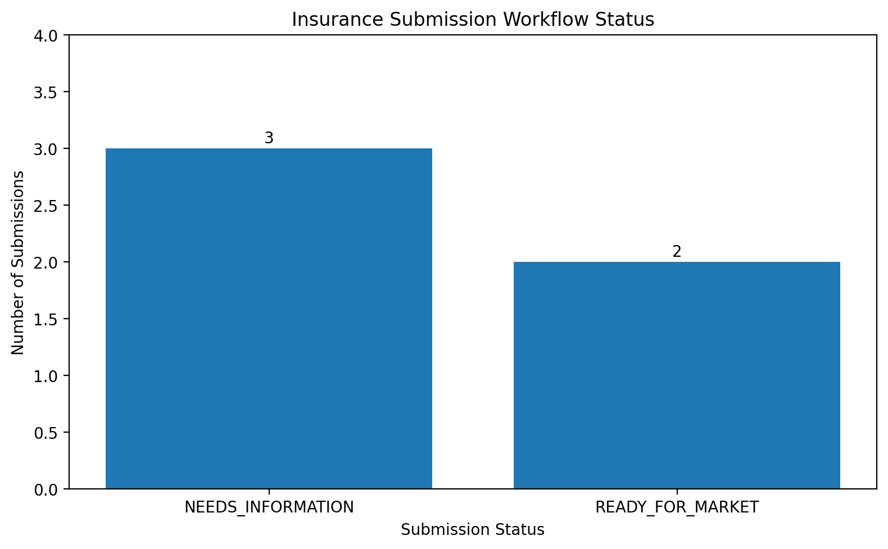

# Insurance Submission Processing and Triage Agent

A Python based prototype that converts unstructured commercial insurance broker submissions into structured records, validates submission information, identifies missing or conflicting data, determines workflow actions, generates broker follow ups, and evaluates extraction performance against known ground truth.

The project explores how reliable automation and agent style workflows can reduce manual work involved in processing commercial insurance submissions.

---

## Overview

Commercial insurance submissions can arrive through emails, forms, PDFs, spreadsheets, and supporting documents.

Before an account can move forward, important information needs to be identified and checked. Missing, invalid, or conflicting information can create additional back and forth between brokers and insurance teams.

This project demonstrates a simplified workflow for automating part of that process.

The system can:

1. Accept an unstructured broker submission
2. Extract important insurance information
3. Convert the information into a structured record
4. Detect missing information
5. Validate extracted values
6. Detect conflicting information across sources
7. Assign a workflow status
8. Determine the next action
9. Generate a broker follow up when information is missing
10. Evaluate extraction performance against known ground truth

---

## Workflow

```text
Broker Submission
        |
        v
Information Extraction
        |
        v
Structured Insurance Record
        |
        v
Validation
        |
        +---------------------------+
        |                           |
        v                           v
Missing Information       Invalid / Conflicting Data
        |                           |
        v                           v
NEEDS_INFORMATION             REVIEW_REQUIRED
        |                           |
        v                           v
Broker Follow Up               Human Review

Complete and Valid
        |
        v
READY_FOR_MARKET
        |
        v
Carrier Review
```

---

## Example Broker Submission

The workflow begins with an unstructured broker message.

```text
Please provide a General Liability quote for BlueRock Builders LLC.

The company operates in Texas and generates approximately $3.6M
in annual revenue. They currently have 27 employees.

Coverage should begin November 5, 2026.

Subcontractors account for about 25% of their work.
```

The extraction pipeline converts the message into a structured record.

```text
company             : BlueRock Builders LLC
coverage            : General Liability
state               : Texas
revenue             : None
employees           : 27
effective_date      : 2026-11-05
loss_history        : None
subcontractor_pct   : 25
```

In this example, the deterministic extractor does not recognize the alternate revenue phrasing.

Rather than inventing a value, the workflow treats the field as unresolved.

```text
Status:
NEEDS_INFORMATION

Missing information:
Annual revenue
Loss history

Next action:
Request missing information from broker
```

This demonstrates an important design principle of the prototype: uncertain information should be surfaced rather than silently guessed.

---

## Broker Follow Up Generation

When required information is missing, the workflow automatically prepares a follow up requesting only the unresolved information.

Example:

```text
Hi,

Thank you for sending the submission for BlueRock Builders LLC.

Before we can continue reviewing the account, we still need the following information:

1. Annual revenue
2. Loss history

Once we receive these details, we can continue processing the submission.

Thank you.
```

This connects information extraction directly to an operational next action.

---

## Submission Triage

The prototype uses three workflow states.

| Status | Meaning | Next Action |
| --- | --- | --- |
| `READY_FOR_MARKET` | Required information is available and passes validation | Continue to carrier review |
| `NEEDS_INFORMATION` | Required information is missing | Request information from broker |
| `REVIEW_REQUIRED` | Invalid or conflicting information is detected | Escalate for human review |

The goal is not to force every submission through automation.

The workflow intentionally provides a human review path when it encounters information that should not be resolved automatically.

---

## Data Validation

Extracted information is checked before the submission moves forward.

The prototype includes basic validation for values such as:

```text
Annual revenue > 0

Employee count > 0

0 <= Subcontractor percentage <= 100

Effective date must use a valid date format
```

These validation rules are simplified assumptions created for this prototype and should not be interpreted as actual carrier underwriting requirements.

---

## Conflict Detection

Insurance information can come from multiple sources, and those sources may not always agree.

For example:

```text
Broker email revenue:     $3.2M
Application revenue:      $4.1M
```

The system does not automatically decide which value is correct.

Instead, the submission is routed to review.

```text
Status:
REVIEW_REQUIRED

Next action:
Escalate submission for manual review
```

This provides a simple example of data integrity and failure handling within an automated workflow.

---

## Evaluation

The extraction pipeline was evaluated against synthetic submissions with known ground truth.

### Initial Benchmark

The first benchmark contained five submissions and eight evaluated fields per submission.

```text
Submissions:       5
Fields evaluated: 40
Correct:           40
Incorrect:         0
Accuracy:          100.0%
```

These examples were used while developing and improving the extraction pipeline.

Because the initial examples influenced development, the 100% result should not be interpreted as generalization performance.

### Unseen Submission Benchmark

A second set of synthetic submissions introduced different wording that was not used in the initial extraction benchmark.

```text
Unseen submissions: 5
Fields evaluated:   40
Correct:             35
Incorrect:            5
Accuracy:           87.5%
```

### Field Level Results

| Field | Accuracy |
| --- | ---: |
| Company | 80% |
| Coverage | 100% |
| Effective Date | 60% |
| Employees | 80% |
| Loss History | 100% |
| Revenue | 80% |
| State | 100% |
| Subcontractor Percentage | 100% |

The unseen benchmark exposed failures caused primarily by linguistic variation in company identification, revenue descriptions, employee descriptions, and effective date wording.

This demonstrates a limitation of deterministic extraction and identifies areas where a model based extraction layer or broader parsing strategy could improve robustness.

---

## Workflow Results

The initial five submissions produced the following workflow distribution:



```text
NEEDS_INFORMATION    3
READY_FOR_MARKET     2
```

The workflow identifies which submissions contain sufficient information to continue and which require additional broker information.

---

## Reliability and Failure Handling

A major goal of this project was to avoid treating information extraction as the entire problem.

A useful operational workflow also needs to decide what happens when extraction fails or information is unreliable.

The prototype separates several failure conditions:

```text
Missing Value
      |
      v
NEEDS_INFORMATION
      |
      v
Request Broker Information


Invalid Value
      |
      v
REVIEW_REQUIRED
      |
      v
Human Review


Conflicting Values
      |
      v
REVIEW_REQUIRED
      |
      v
Human Review


Complete and Valid
      |
      v
READY_FOR_MARKET
      |
      v
Continue Processing
```

This allows extraction failures and uncertain information to become explicit workflow states rather than hidden errors.

---

## End to End Processing

The complete prototype follows this workflow:

```text
Broker Email
    |
    v
Information Extraction
    |
    v
Structured Insurance Record
    |
    v
Missing Information Detection
    |
    v
Data Validation
    |
    v
Conflict Detection
    |
    v
Submission Triage
    |
    +-------------------------+
    |            |            |
    v            v            v
READY        NEEDS INFO      REVIEW
    |            |            |
    v            v            v
Carrier      Broker         Human
Review       Follow Up      Review
    |
    v
Evaluation Against Ground Truth
```

---

## Evaluation Approach

The project evaluates predictions at the individual field level.

For each submission, the extracted value is compared against known synthetic ground truth.

Fields evaluated include:

```text
Company
Coverage
State
Annual Revenue
Employee Count
Effective Date
Loss History
Subcontractor Percentage
```

The evaluation pipeline records:

```text
Submission ID
Field
Expected Value
Predicted Value
Correct / Incorrect
```

This makes extraction failures directly inspectable instead of relying only on an overall accuracy number.

---

## Why Test on Unseen Wording?

A deterministic extractor can perform very well on examples that resemble the data used during development.

That does not necessarily mean it will handle new broker language reliably.

For this reason, the project includes a separate challenge set containing different sentence structures and descriptions.

The initial benchmark achieved:

```text
40 / 40 correct
100.0%
```

The unseen benchmark achieved:

```text
35 / 40 correct
87.5%
```

The difference between these results helps expose where the extraction strategy does not generalize.

Rather than modifying the rules specifically to memorize every challenge example, the remaining failures are preserved as evidence of the current system's limitations.

---

## Example Failure Analysis

One unseen submission contained the sentence:

```text
The company operates in Texas and generates approximately $3.6M
in annual revenue.
```

The current deterministic extractor failed to recognize the revenue because the sentence structure differed from the patterns used during development.

The resulting structured record contained:

```text
revenue: None
```

The workflow then classified the submission as:

```text
NEEDS_INFORMATION
```

Instead of assuming or fabricating the revenue value, the system generated a request for clarification.

This example demonstrates both a limitation of the current extraction approach and the importance of safe failure handling.

---

## Project Structure

```text
insurance-submission-processing-triage-agent/
|
|-- Insurance_Submission_Processing_and_Triage_Agent.ipynb
|
|-- README.md
|
|-- results/
|   |
|   |-- initial_evaluation_results.csv
|   |
|   |-- challenge_evaluation_results.csv
|   |
|   |-- submission_summary.csv
|   |
|   |-- challenge_extracted_records.csv
|   |
|   |-- submission_dashboard.png
|   |
|   |-- example_broker_followup.txt
|
|-- LICENSE
```

---

## Technologies

### Python

Used to implement the extraction, validation, triage, follow up, and evaluation workflow.

### Pandas

Used for structured submission records, ground truth datasets, evaluation results, and workflow summaries.

### NumPy

Used for numerical comparisons during evaluation.

### Regular Expressions

Used as the deterministic baseline for extracting structured information from unstructured broker messages.

### Matplotlib

Used to visualize submission workflow results.

### Google Colab

Used to develop and test the prototype.

---

## Design Decisions

### Deterministic Extraction as a Baseline

The first version intentionally uses deterministic extraction.

This creates a transparent baseline where extraction behavior can be directly inspected, tested, and debugged.

The unseen benchmark then shows where rule based extraction begins to struggle with linguistic variation.

### Ground Truth Evaluation

A workflow can appear correct while still extracting incorrect information.

For this reason, extracted fields are evaluated against known ground truth rather than relying only on visual inspection.

This also makes it possible to compare future extraction approaches against the same benchmark.

### Explicit Failure States

The workflow distinguishes between missing, invalid, and conflicting information.

These conditions lead to different actions rather than being treated as a single generic error.

### Human Escalation

The prototype does not attempt to automatically resolve every problem.

Conflicting or invalid information is routed to human review.

This prevents the workflow from silently choosing between contradictory values.

---

## Current Limitations

This project is a lightweight prototype built using synthetic data.

It does not currently include production insurance infrastructure such as:

* Real broker or customer data
* PDF document parsing
* OCR
* Email integrations
* Carrier APIs
* Persistent databases
* Background job processing
* Authentication
* Production monitoring
* Retry infrastructure
* LLM based extraction
* Confidence scoring
* Human review interfaces

The deterministic extractor should therefore be viewed as a baseline for experimentation rather than a production document understanding system.

---

## Possible Next Steps

A future version could extend the prototype with:

* LLM based structured information extraction
* Confidence scores for individual extracted fields
* PDF and attachment processing
* Email ingestion
* Automated broker communication
* Carrier appetite matching
* Persistent submission state
* Background processing
* Retry and failure recovery mechanisms
* Human approval queues
* Carrier API integrations
* Production monitoring
* Larger synthetic evaluation datasets
* Regression testing across extraction versions

The existing evaluation framework could then be reused to measure whether each improvement actually increases reliability.

---

## Data and Privacy

All broker submissions, companies, ground truth values, and insurance records used in this project are synthetic.

No real broker, customer, carrier, policyholder, or proprietary insurance data is included.

The examples were created solely to demonstrate the engineering workflow and evaluation methodology.

---

## Key Takeaways

This prototype demonstrates several ideas that are important when building reliable automation around operational workflows:

* Converting unstructured communication into structured data
* Detecting incomplete submissions
* Validating extracted information
* Identifying conflicting values
* Connecting data quality to workflow decisions
* Generating operational follow ups
* Providing explicit human escalation paths
* Evaluating extraction against ground truth
* Testing generalization on unseen wording
* Inspecting failures rather than hiding them

The project is intentionally small, but the architecture demonstrates how submission processing can move beyond simple extraction into a workflow that determines what should happen next.

---

## Author

**Sourabh More**

M.S. Computer Science  
Oregon State University

Interests include AI evaluation, simulation validation, Python automation, and reliable engineering workflows.
